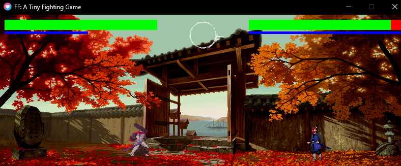

# FF

A tiny Love2D fighting game.




#### Controller Support?

Sure, https://www.rewasd.com/

Keymaps in `keymap.lua`

#### Multiplayer?

Sure, https://moonlight-stream.org/

## Run

```sh
love src
```

to generate FFT data

```sh
python fft/fft.py
```

> PS: Don't ask about the FFT code. It's dubious.

## Acknowledgements

I do not own any of the assets used in this game.

## TODO

- [ ] Binary data to represent FFT data (binrary json)
- [ ] Decouple the framedata from the hitbox data and add active/startup frames
- [ ] Fixed clashing dy knockback
- [ ] Rock entity! Interact with rock (pray)?
- [ ] Fix basic AI and settings passing logic
- [ ] Fix sprite scaling in character select
- [ ] Countdown to fight (maybe not explicit) and fighter enter anims?
